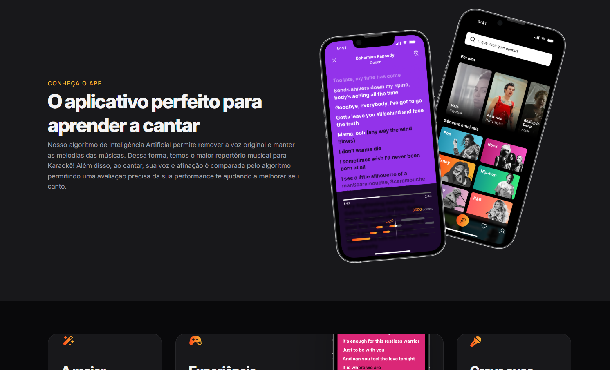

<h1 align="center"> ZINGEN </h1>

 projeto Landing Page de aplicativo 

  <a href="#-tecnologias">Tecnologias</a>&nbsp;&nbsp;&nbsp;|&nbsp;&nbsp;&nbsp;
  <a href="#-projeto">Projeto</a>&nbsp;&nbsp;&nbsp;|&nbsp;&nbsp;&nbsp;
  <a href="#-layout">Layout</a>&nbsp;&nbsp;&nbsp;|&nbsp;&nbsp;&nbsp;
  <a href="#memo-licença">Licença</a>

  

 

## 🚀 Tecnologias

Esse projeto foi desenvolvido com as seguintes tecnologias:

- HTML e CSS
- Git e Github
- Figma

  ## 💻 Projeto

Nesse projeto você vai desenvolver a Landing Page de marketing completa e responsiva de um aplicativo de Karaokê chamado Zingen.
Esse é um dos projetos desenvolvidos em aula na formação Full-stack, um de nossos conteúdos de especialização.

## 🔖 Layout

Você pode visualizar o layout do projeto através [DESSE LINK]([https://www.figma.com/community/file/1187422022288947321](https://www.figma.com/design/ZA2UPbv69O65YnAoPc6ODe/LP-de-produto--Community-?node-id=908-1045&t=mufn0nPjKc7Uj6Vk-0)). É necessário ter conta no [Figma](https://figma.com) para acessá-lo.

## 📝 Licença

Esse projeto está sob a licença MIT.

---

Feito com ♥ by Rocketseat 👋 Participe da nossa comunidade!
